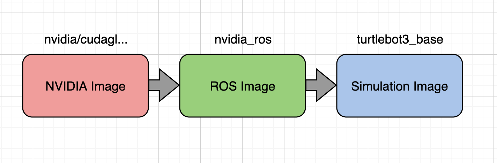
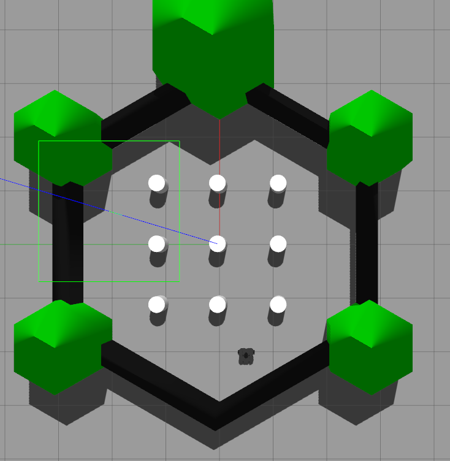

# To Study how to use ROS with docker
##  To forward X11 (monitor) from docker to host's monitor
Do not use docker desktop. It's a keng
Install Enginer only

```
https://docs.docker.com/engine/install/ubuntu/
```

After install the docker engine, use the command

```
docker context use default
```
# install Nvidia driver for docker

```
curl -fsSL https://nvidia.github.io/libnvidia-container/gpgkey | sudo gpg --dearmor -o /usr/share/keyrings/nvidia-container-toolkit-keyring.gpg \
  && curl -s -L https://nvidia.github.io/libnvidia-container/stable/deb/nvidia-container-toolkit.list | \
    sed 's#deb https://#deb [signed-by=/usr/share/keyrings/nvidia-container-toolkit-keyring.gpg] https://#g' | \
    sudo tee /etc/apt/sources.list.d/nvidia-container-toolkit.list
```

```
sed -i -e '/experimental/ s/^#//g' /etc/apt/sources.list.d/nvidia-container-toolkit.list
```

```
sudo apt-get update
```

```
sudo apt-get install -y nvidia-container-toolkit
```

# Configure Nvidia driver for docker for X forward

```
sudo nvidia-ctk runtime configure --runtime=docker
sudo systemctl restart docker
nvidia-ctk runtime configure --runtime=docker --config=$HOME/.config/docker/daemon.json
systemctl --user restart docker
sudo nvidia-ctk config --set nvidia-container-cli.no-cgroups --in-place
```

Change The config file

```
sudo vi /etc/nvidia-container-runtime/config.toml
```
set no-cgroups to false
```
no-cgroups = false
```

Test The Nvidia driver for docker

```
sudo docker run --rm --runtime=nvidia --gpus all ubuntu nvidia-smi
```

If the sudo version works, try non-sudo version

```
docker run --rm --runtime=nvidia --gpus all ubuntu nvidia-smi
```

# Test X forward

```
cd gimp
docker build . -t gimp:0.1
```

Test with Sudo version

```
sudo docker run --rm -it --name gimp -e DISPLAY=$DISPLAY -v /tmp/.X11-unix:/tmp/.X11-unix:ro --runtime=nvidia --gpus all gimp:0.1
```

Test with non-sudo version

```
docker run --rm -it --name gimp -e DISPLAY=$DISPLAY -v /tmp/.X11-unix:/tmp/.X11-unix:ro --runtime=nvidia --gpus all gimp:0.1
```
You should see GIMP drawing app appears on your linux screen.

# Rviz only

```
xhost +local:root
docker run -it -e DISPLAY=$DISPLAY -v /tmp/.X11-unix:/tmp/.X11-unix --gpus all osrf/ros:noetic-desktop-full bash
    Inside docker prompt
    #roscore &
    #rviz
```

# Turtlebot on Rviz

Build docker by multiple stage as shown in image



```
cd nvidia_ros
docker build -f dockerfile_nvidia_ros -t nvidia_ros .
```

```
cd docker_ros_test
docker build -f dockerfile_tb3 -t turtlebot3_base .
```

```
xhost +local:root
docker run -it --net=host -e DISPLAY=$DISPLAY -v /tmp/.X11-unix:/tmp/.X11-unix --gpus all turtlebot3_base:latest bash
```
inside docker run

```
roslaunch turtlebot3_gazebo turtlebot3_world.launch
```

to see the image below



# Ros package inside docker
tb3_navigation package

How to run
```
docker run -it --net=host -e DISPLAY=$DISPLAY -v /tmp/.X11-unix:/tmp/.X11-unix --gpus all turtlebot3_overlay bash
```
or, with volume, 
```
docker run -it --net=host -e DISPLAY=$DISPLAY -v /tmp/.X11-unix:/tmp/.X11-unix --gpus all --volume="${PWD}/tb3_navigation":"/overlay_ws/src/tb3_navigation":rw turtlebot3_overlay bash
```
